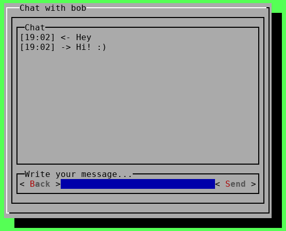

# BriarJar

BriarJar is a prototype based on the messenger [Briar](https://briarproject.org) and
was developed in the course of a diploma project in the year 2022.
The related diploma thesis is available [here](BriarJar_Diploma_Thesis.pdf).
BriarJar consists of two different user interfaces, a graphical one (GUI) and a
terminal one (TUI). It can run on major GNU/Linux distributions and offers
the following functionalities: registration of an account, management of
contacts, as well as a text communication with a desired conversation partner.

You can get in touch with us via `briarjar@briarproject.org`. 
For this project e-mail address we decided to not offer a PGP key. The inbox is checked by us from time to time.

### Disclaimer

BriarJar is considered as finalised and will not be maintained any further. 
Please use BriarJar only within a testing environment. 
For matured software and more information please visit the website of the messenger Briar: https://briarproject.org/

### GUI Preview


### TUI Preview



### Requirements

- A GNU/Linux Distribution
- [Java Development Kit 17](https://jdk.java.net/17/) or higher
- For GUI Mode: A display server like Xorg or Wayland

### Usage

Make sure you have the correct Java version:
```
java -version
```

To start in GUI Mode, simply run the FatJAR with
```
java -jar --add-opens=java.base/java.lang.reflect=ALL-UNNAMED briarjar-1.00-all.jar
```

The TUI Mode can be invoked with either  
```
java -jar briarjar-1.00-all.jar -t
```
or
```
java -jar briarjar-1.00-all.jar --tui
```

### Options

```
BriarJar version 1.00 Copyright (C) 2022 BriarJar Project Team

Options:
-t, --tui        Start in TUI mode (default is GUI)

-h, --help       Show (this) help menu
-v, --verbose    Show all logs (floods the TUI, discouraged)
```

### Building

The briar-as-subproject submodule has to be cloned too, when cloning BriarJar. 
```
git clone --recurse-submodules git@code.briarproject.org:briar/briarjar 
```

Simply run the ShadowJar Gradle Task to compile the FatJAR.

```
./gradlew shadowJar
```

ShadowJar will create the jar-file in the directory `build/libs/`

For convenience, you can use the `start_briarjar.sh` script after building.
```
./start_briarjar.sh [options]
```

## License

BriarJar is free software: you can redistribute it and/or modify
it under the terms of the GNU Affero General Public License as
published by the Free Software Foundation, either version 3 of the
License, or (at your option) any later version.

BriarJar is distributed in the hope that it will be useful,
but WITHOUT ANY WARRANTY; without even the implied warranty of
MERCHANTABILITY or FITNESS FOR A PARTICULAR PURPOSE.  See the
[GNU Affero General Public License](LICENSE.md) for more details.

You should have received a copy of the GNU Affero General Public License
along with BriarJar.  If not, see <https://www.gnu.org/licenses/>.
